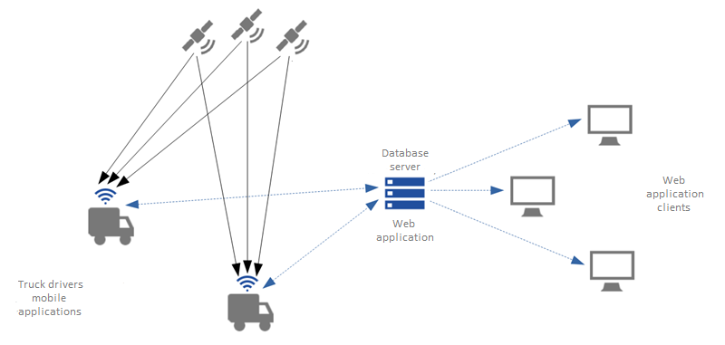
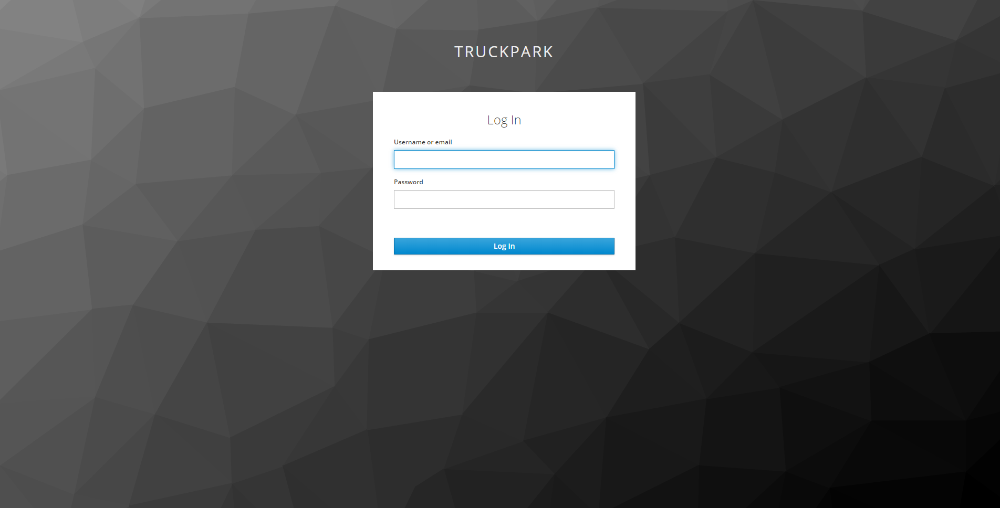
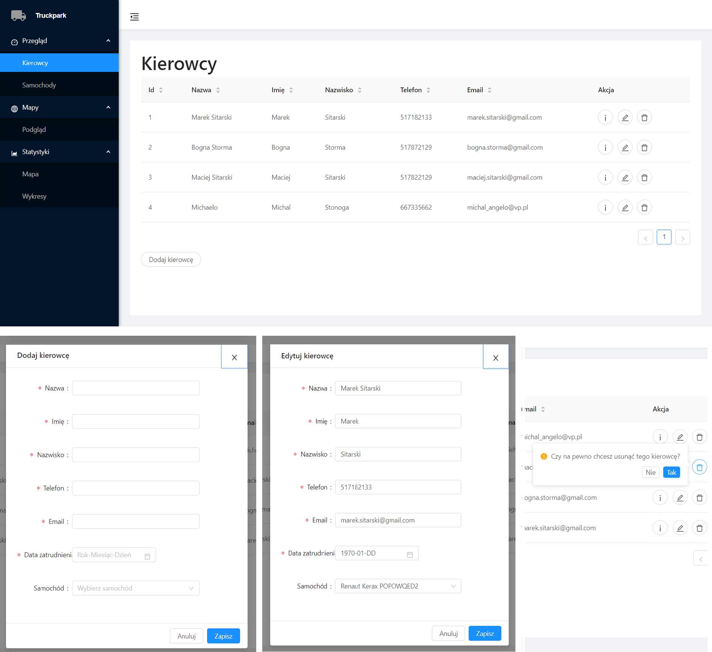
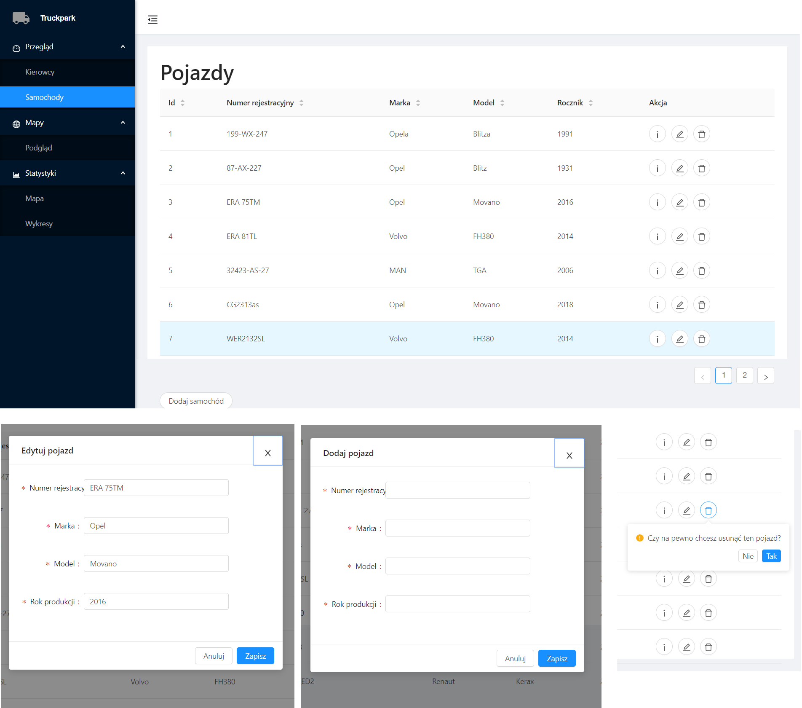
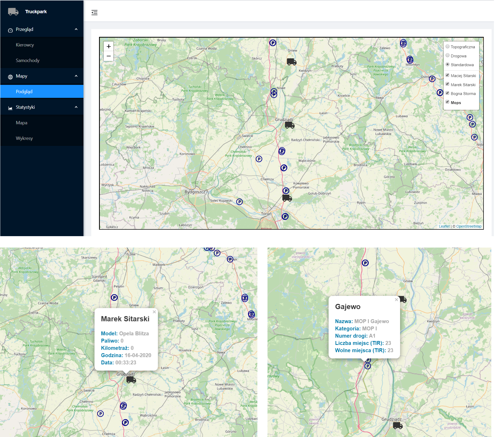

# TruckPark - server side
> The application has been designed and created as a complex solution for truck drivers and truck fleet companies to optimize the time of work and control trucks fleet. Both companies' management and truck divers could take huge benefits by using it due to economizing time and money. The system consists of two components. This Github repository concerns a server component.
 
## Table of contents
* [General info](#general-info)
* [Features](#features)
* [Technologies](#technologies)
* [Status](#status)
* [Inspiration](#inspiration)
* [Contact](#contact)

## General info
> The main features of the application are the possibility to control the truck fleet in real-time and providing a connection between database and truck driver's mobile applications. Through the app either fleet manager or supervisor has got access to preview where is current driver right now, how much time driver is working, did driver has taken a proper break already, etc. It is also a possibility to find particular info about the actual driver or statistics of all drivers in a company. Fleet management functions contain add, delete and edit a truck driver or truck as well.

## Features

### User authentication and authorization
> Identity and access management concepts are provided by the Keycloak solution. The system is accessible only for users added to the Keycloak realm. Currently, there are three main grouping roles, which contains dedicated roles:
* TRUCKPARK_DRIVER - {MOP_READ, DRIVER_READ, TRUCK_READ, TDW_CREATE}
* TRUCKPARK_USER_SPECTATOR - {MOP_READ, DRIVER_READ, TRUCK_READ, TDW_READ, COMPANY_READ}
* TRUCKPARK_USER_EDITOR - {MOP_READ, DRIVER_CREATE, DRIVER_READ, DRIVER_UPDATE, DRIVER_DELETE, TRUCK_CREATE, TRUCK_READ, TRUCK_UPDATE, TRUCK_DELETE, TDW_READ, COMPANY_READ } 
> Because of that, TRUCKPARK_USER_SPECTATOR has a privilege only for view data, while a user with TRUCKPARK_DRIVER role can also send its position and data(TDW_CREATE). Access to features based on authorization processes is implemented both on the frontend part (disable buttons, modify DOM based on singular roles) and backend part (Spring Security configuration which guards rest endpoints and methods depend on singular roles).

 

### Users managment
>Under Deployment.
### Drivers managment
> Typical crud-management feature which let the user creating, read, update and delete drivers belonging to a user's company. Data inputted during adding and editing are validated both on the frontend and backend side. All accessible drivers are presented in a table while adding and editing are proceeding in a user-friendly modal view. Additionally, the deleting driver requires to confirm in a small popconfirm window. The driver is in relation with a truck.

 

### Trucks managment
> Typical crud-management feature which let the user creating, read, update and delete trucks belonging to a user's company. Data inputted during adding and editing are validated both on the frontend and backend side. All accessible trucks are presented in a table while adding and editing are proceeding in a user-friendly modal view. Additionally, the deleting truck requires to confirm in a small popconfirm window and it is only possible if there is no drivers in relation with the truck. 

### Fleet managment and control
> It is the realization of one of the most important demands of this project - a truck's fleet control and management in real-time. After opening a dedicated tab, the user can see the default base map (default one, there are two other radio possibilities - road and topo map) and custom layer with current positions of drivers (positions and pieces of information are updated every minute). Every driver has a dedicated layer so it is possible to track only chosen drivers. Currently, there is a possibility to add custom resting places points as well. Informations are updated every 5 minutes. Every point (trucks and pois) on the map have user-friendly pop-up windows to check information easily.     

### Truck driver searching based on many parameters
>Under Deployment.
### Keeping connection beetween database and mobile application
>Under Deployment.
### Statistics
>Under Deployment.

## Technologies
* Java SE 13
* Spring Boot 2.2.2
* Spring Web MVC 5.2.3
* Spring Boot Data JPA 2.2.2
* Spring Boot Security 2.2.6
* REST API
* Angular 9.0.6
* TypeScript 3.7.5
* Hibernate ORM 5.4.2
* Hibernate Validator 6.0.17
* FasterXML/Jackson 2.9.10
* Leaflet 1.6.0
* AntDesign 4.1.1
* Keycloak 10.0.0
* Docker 19.03.8

## Status
Project is: _in_progress_.

## Inspiration
The project has been being created as a continuation of the author's master thesis - "Developing time optimization system for truck drivers" completed in 2018. Theoretical conceptions proposed in the document have been being implemented in this software. The main goal of this project is putting theory into practice.

## Contact
Creating by [@Marek Sitarski](https://pl.linkedin.com/in/marek-sitarski) - marek_sitarski@vp.pl. 

